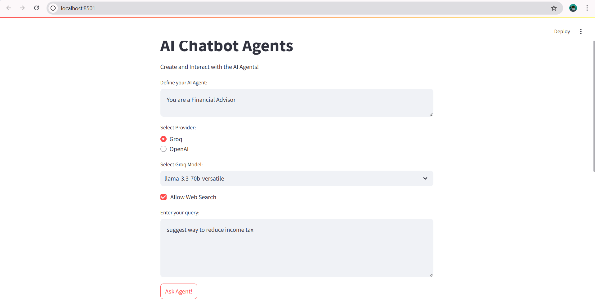
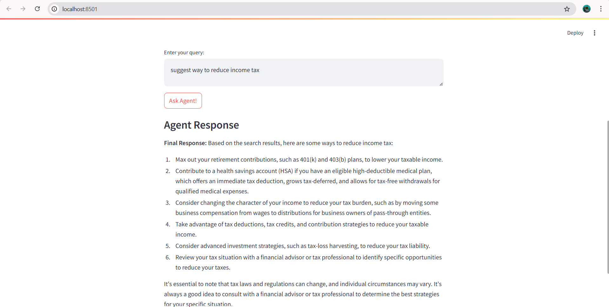

# 🤖 LangGraph AI Agent
## 📌 Project Overview

This project implements an AI Chatbot Agent powered by LangGraph, Groq, OpenAI, and Tavily Search. It provides both a FastAPI backend and a Streamlit UI frontend, enabling users to interact with multiple LLMs (like LLaMA 3.3 and GPT-4o-mini) and optionally leverage web search for real-time answers.

## 🚀 Features

✅ Support for multiple model providers (Groq, OpenAI)
✅ Integration with Tavily Search for live web search
✅ FastAPI backend for modular agent response serving
✅ Streamlit UI frontend for easy interaction
✅ Swagger UI support for API exploration
✅ Customizable system prompts for agent personality
---

## 📂 Project Structure

```
LangGraph_AI_Agent/
│
├── ai_agent.py               # Core logic: builds LangGraph agent & returns responses
├── app.py                    # FastAPI backend (API endpoint for chatbot)
├── ui.py                     # Streamlit frontend (chat UI)
│
├── requirements.txt          # Required Python packages
├── .env                      # API keys (Groq, OpenAI, Tavily)
└── README.md                 # Project documentation
```

## ▶️ Running the Project
Run Backend (FastAPI)
python app.py


This starts the API server at: http://127.0.0.1:9999

You can explore docs at: http://127.0.0.1:9999/docs

Run Frontend (Streamlit UI)
streamlit run ui.py


## 💡 Future Improvements

🧠 Add support for more providers (Anthropic, Cohere, etc.)
📊 Store chat history in database (MongoDB / PostgreSQL)
🌐 Deploy on cloud (AWS, Render, or HuggingFace Spaces)
🎨 Improve UI with chat bubbles & history tracking
🔍 Integrate caching layer for search queries

Below is a preview of the Streamlit application:



